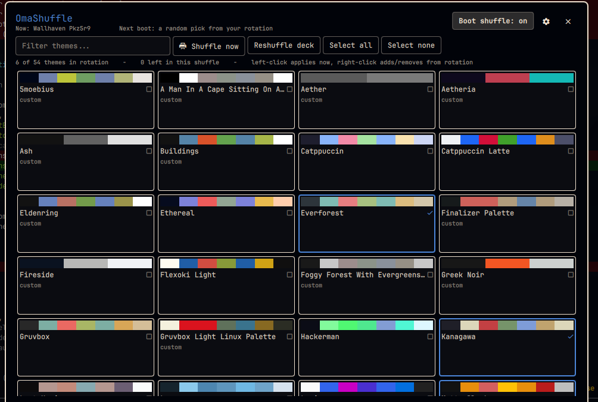
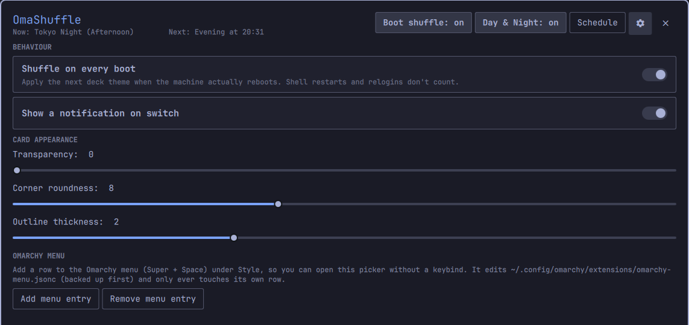

<div align="center">


# OmaShuffle

**A fresh [Omarchy](https://omarchy.org/) theme every time you boot.**

Pick the themes you like once. From then on, every real boot deals you the next
one from a shuffled deck — no repeats until you've seen them all.


<br><br>



</div>

## Is this for you?

- You installed six themes, loved the third one for a week, and now you're bored again.
- You keep `omarchy theme set`-ing around at 1am instead of sleeping.
- You genuinely can't decide, and honestly you'd rather your computer just surprised you.
- You like your desk to feel a little different on a Monday than it did on Friday.

If any of that landed: this is for you. OmaShuffle turns "ugh, which theme
today" into a decision you already made, once, in a nice grid.

## How it works

You open the picker and tick the themes you want in the rotation. That's the
whole setup.

After that, **every real boot** OmaShuffle quietly applies the next theme in the
deck. The deck is a shuffled bag: every theme you picked comes up exactly once,
then the bag reshuffles and the theme you're currently wearing is pushed to the
back so you don't see it twice in a row.

"Real boot" means a genuine power-on or reboot — the kind where you had to type
your disk-unlock passphrase. It reads `/proc/sys/kernel/random/boot_id`, a value
the kernel regenerates on every boot and keeps stable within one. So:

| This happens | Theme switches? |
|---|---|
| You reboot / power on | **yes** |
| `omarchy restart shell`, or the shell reloads | no |
| You log out and back in | no |
| Suspend / resume, closing the lid | no |

Nothing here is a one-way door. It's a normal `omarchy theme set` under the
hood — grab any theme by hand from the picker (or the usual `omarchy theme`
command) whenever the deck deals you something you're not in the mood for.

## Requirements

- **Omarchy 4** with its Quickshell-based shell
- **`python3`** — the only dependency beyond Omarchy itself. Used once at startup
  to read this plugin's own small state file safely (see *Notes for reviewers*).
  It's present on a normal Omarchy install.

No network access. No elevated privileges. No package management.

## Install

```bash
omarchy plugin add https://github.com/Deunnis/OmaShuffle.git --enable
omarchy restart shell
```

That's it — it starts working from the next boot. Until you pick at least one
theme it does nothing but show a one-line reminder on boot.

## Opening the picker

Three ways, pick whichever you like:

**1. A keybind** (fastest). Add one to `~/.config/hypr/bindings.lua`, on any
combo that's free for you:

```lua
o.bind("SUPER + SHIFT + S", "Theme shuffle", "omarchy-shell shell toggle io.github.omashuffle")
```

**2. The Omarchy menu** (Super + Space). Open the picker once via the keybind or
`omarchy-shell shell toggle io.github.omashuffle`, go to the gear → **Omarchy
menu → Add menu entry**. That adds a **Style → Theme Shuffle** row. You can
remove it again from the same place. If you'd rather add it by hand, drop this
into `~/.config/omarchy/extensions/omarchy-menu.jsonc`:

```jsonc
"style.omashuffle": {"icon":"󰔎","label":"Theme Shuffle","aliases":["shuffle"],"action":"omarchy-shell shell toggle io.github.omashuffle"},
```

**3. IPC**, for scripts: `omarchy-shell shell toggle io.github.omashuffle`

## Using the picker



| Action | What it does |
|---|---|
| **Click** a theme (or **Enter**) | apply it right now |
| **Right-click** a theme (or **Space**) | add / remove it from the rotation |
| Arrow keys | move the highlight |
| **Shuffle now** | jump straight to the next deck theme |
| **Reshuffle deck** | throw out the current order and draw a fresh shuffle |
| **Select all / none** | bulk-edit the rotation |
| **Boot shuffle: on / off** | the master switch for the once-per-boot behaviour |
| **Filter themes…** | narrow the grid by name |
| gear icon | notifications, card transparency / corners / outline, menu entry |
| `Esc` | close (or leave settings) |

The header always tells you what you're wearing now and what's queued for next
boot. The strip along the bottom is your recent history.

## Where it keeps things

Everything lives in one file:
`~/.local/state/omarchy/io.github.omashuffle/state.json`

- `pool` — the theme slugs you put in the rotation
- `deck` — the remaining shuffled order for the current bag; when it empties, a
  fresh shuffle of `pool` is drawn
- `history` — the last 40 themes OmaShuffle applied, with timestamps
- `lastBootId` — the `boot_id` at the last switch, i.e. the "was this a real
  boot" marker
- a few UI prefs (notifications, card transparency / corners / outline)

Delete the file to start over; disable the plugin to stop entirely.

## Notes for reviewers

- **No network. No privileged calls.** The plugin runs `omarchy theme set`,
  `omarchy-shell`, `omarchy-notification-send`, and its own two `python3` helper
  scripts in `bin/`. It makes no network requests, needs no elevated privileges,
  manages no packages or services, and installs nothing.
- **Theme slugs are validated** in `ThemeDeck.js` (`^[a-z0-9][a-z0-9._-]*$`, no
  `/`, no `..`, length-capped) before they are ever passed to
  `omarchy theme set`, on top of that command's own checks.
- **Every file this plugin reads is opened as a bounded, regular, non-symlink
  file** — `state.json` and `current/theme.name` (both under `~/.local/state`)
  and the menu file are opened once with `O_RDONLY | O_NOFOLLOW | O_NONBLOCK`,
  `fstat`-checked on that same descriptor to require `S_ISREG`, and read up to a
  fixed byte cap, so nothing is bounded by what the path claims and a planted
  FIFO or symlink is refused. `state.json` writes go through `FileView` with
  `atomicWrites`.
- **`bin/omashuffle-scan-themes`** enumerates the two standard theme directories
  and pulls hex values out of each `colors.toml` with the bounded descriptor-safe
  read above. It caps theme count, slug length, per-file bytes and total output,
  runs under an outer `timeout`, and never executes anything a theme ships. A
  theme (which may be an installed third-party repo) cannot make it block or grow
  the shell.
- **`bin/omashuffle-menu-entry`** is only ever run when you press *Add menu
  entry* / *Remove menu entry* in the settings pane — the plugin never edits the
  menu file on its own. It reads `~/.config/omarchy/extensions/omarchy-menu.jsonc`
  with the bounded descriptor-safe read, builds the edit in a fresh `O_EXCL` temp
  inode inside that directory (verified to be a real directory you own), then
  `os.replace`s it over the target without following a symlink there. It only
  ever touches a row it owns, and bails without writing if the file layout is
  unfamiliar.
- **`python3`** is the only dependency beyond Omarchy — the two `bin/` scripts
  and the in-QML descriptor-safe readers.

## Not included (by design)

- No theme creation or editing — OmaShuffle only rotates themes that already
  exist. Use `omarchy theme` or a theme-designer plugin for that.
- No schedule other than "once per real boot" — no hourly or daily rotation, no
  time-of-day themes.
- No wallpaper-only shuffle — it switches whole themes via `omarchy theme set`.
- No background blur behind the picker card (transparency / corners / outline
  only, for now).

## Remove

```bash
omarchy plugin remove io.github.omashuffle
omarchy restart shell
```

Your last theme stays applied. If you added the menu row, remove it first from
the settings pane (*Remove menu entry*), or delete the `style.omashuffle` line
from `~/.config/omarchy/extensions/omarchy-menu.jsonc` yourself. Delete
`~/.local/state/omarchy/io.github.omashuffle/` to clear the rotation and history.

## Development

```bash
omarchy plugin validate ~/.config/omarchy/plugins/io.github.omashuffle
python3 -m py_compile bin/omashuffle-menu-entry bin/omashuffle-scan-themes
node --check <(tail -n +2 ThemeDeck.js)   # strip the .pragma line
omarchy restart shell                     # plugin QML is cached by URL
```

`ThemeDeck.js` is pure logic with no QML or I/O dependencies — the easy place to
reason about shuffling, the no-immediate-repeat rule, and slug validation.

## License

MIT — see [LICENSE](LICENSE).
